# AI Receipt Expense Tracker Setup

## Step 1: Create Your Own Copy of the Spreadsheet

Open the spreadsheet template:

**[INSERT YOUR SPREADSHEET TEMPLATE LINK HERE]**

Choose:

File → Make a copy

Create a copy in your own Google Drive.

---

## Step 2: Create Google Drive Folders

Create two folders anywhere in your Google Drive.

### Receipts

This is where you will upload new receipt photos.

### Processed Receipts

This is where receipts will be moved after they have been imported.

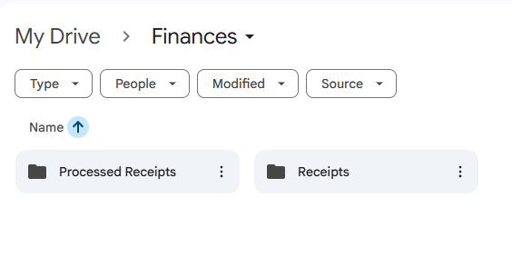

---

## Step 3: Get a Gemini API Key

Google provides a free Gemini API tier that is more than enough for most personal budgeting needs.

Visit:

https://aistudio.google.com

Sign in with your Google account.

Choose:

Get API Key (Small key icon in the bottom left-hand corner)

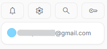

Create a new API key.

Copy the key somewhere safe.

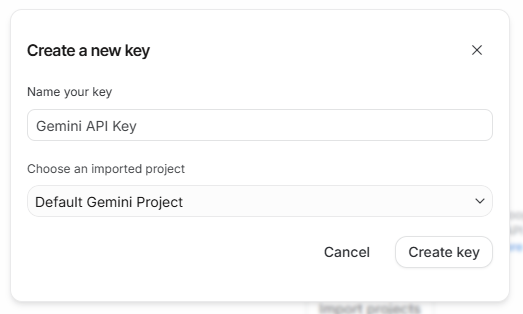

### Important

Anyone with your API key can use your Gemini quota.

Do not share your API key publicly.

Never commit it to GitHub.

---

## Step 4: Get Folder IDs

Open your Receipts folder.

The URL will look something like:

```text
https://drive.google.com/drive/folders/1AbCdEfGhIjKlMnOpQrStUvWxYz
```

Copy the part after:

```text
folders/
```

That long string is your Folder ID.

Repeat for:
- Receipts
- Processed Receipts

---

## Step 5: Open Google Apps Script

Inside your spreadsheet choose:

Extensions → Apps Script

A new Apps Script project will open.

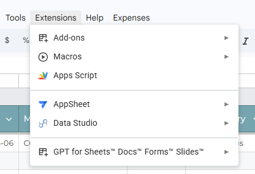

Delete any starter code.

---

## Step 6: Install the Script

Download the Apps Script file from this repository:

[Apps Script Code](Code.gs)

Copy the entire contents into Apps Script.

Save the project.

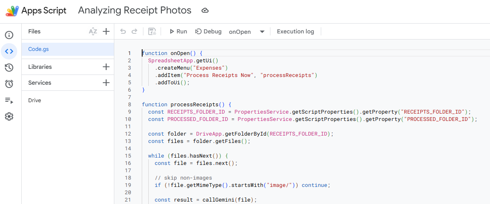

---

## Step 7: Add Script Properties

In Apps Script:

In the left hand menu you will see a gear icon that says "Project Settings".

Project Settings → Script Properties (scroll all the way down)

Create the following properties using the values you copied in steps 3 and 4.

| Property | Value |
|-----------|---------|
| GEMINI_API_KEY | Your Gemini API key |
| RECEIPTS_FOLDER_ID | Receipts folder ID |
| PROCESSED_FOLDER_ID | Processed folder ID |

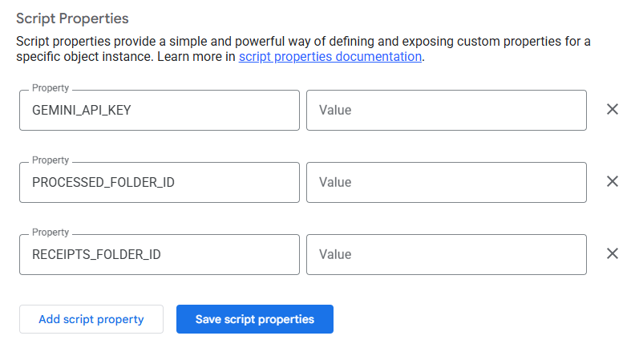

Save the script properties.


---

## Step 8: Add Drive Service

On the editor page in App Script you will see a section called "Services" in the menu.

Click on the plus button.

Search for "Drive API", select it and click "Add".

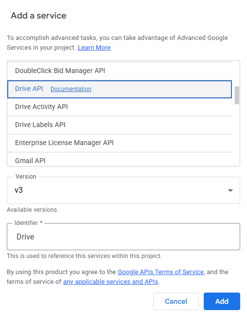

---

## Step 9: Grant Permissions

Run the function:

```javascript
processReceipts
```

for the first time.


Google will ask for permission.

Review the permissions and approve them.

This only needs to be done once.

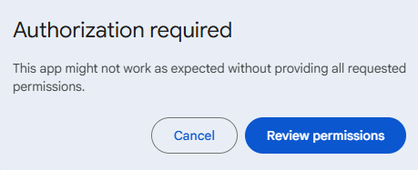

This isn't code that Google has verified, so you'll get this warning.

Click on "Advanced" and then "Go to Project (unsafe)"

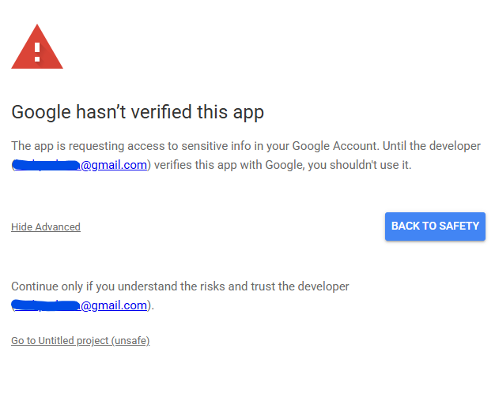

Then select all and click "Continue".

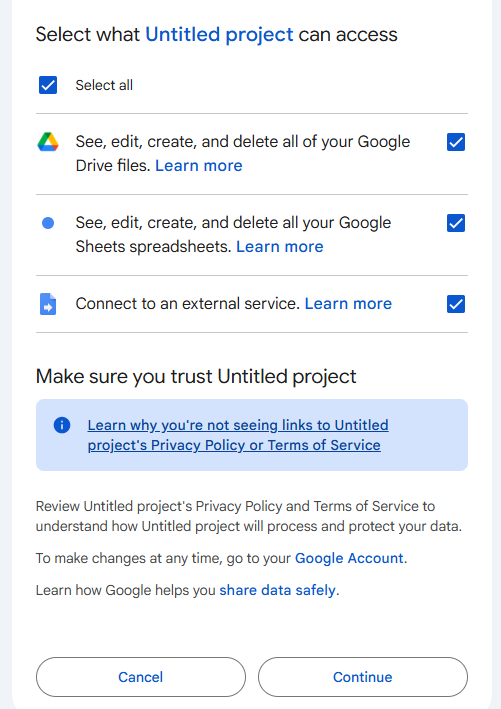

---

## Step 10: Create an Automatic Trigger

In Apps Script choose:

Triggers → Add Trigger

Settings:

| Setting | Value |
|-----------|---------|
| Function | processReceipts |
| Event Source | Time-driven |
| Type | Hour timer |
| Frequency | Every hour |

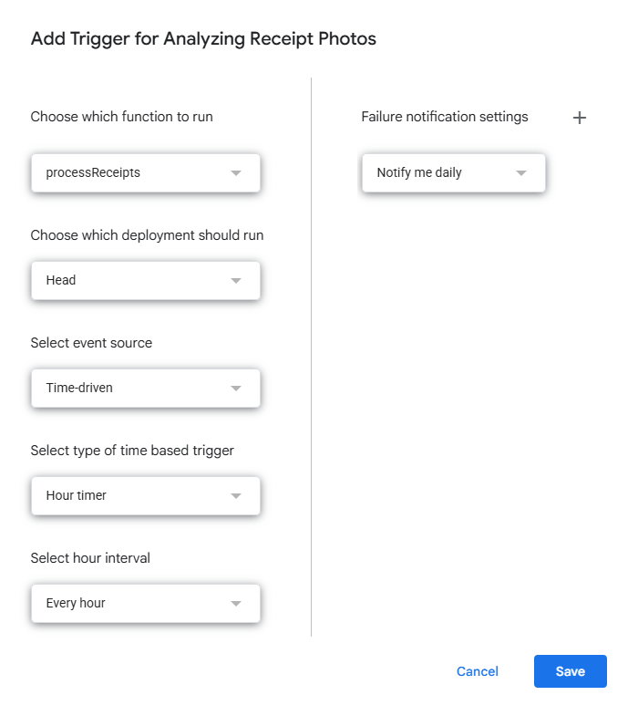

### Why Hourly?

Running every hour:
- Uses fewer Apps Script resources.
- Uses less Gemini quota.
- Is still effectively automatic.

However, you can adjust this to run however frequently you desire.

---

## Step 11: Test the System

Upload a receipt image into the Receipts folder.

Wait for the trigger, run the processReceipts function from Apps Script, or there should be a button in your spreadsheet on the Template tab labelled "Process Receipts" that you can press.


The system should:

1. Read the receipt.
2. Extract the information.
3. Add rows to the spreadsheet.
4. Move the file to Processed Receipts.

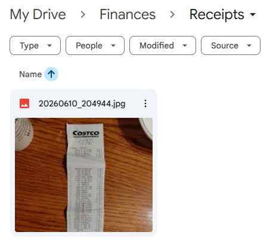

---

## Security Notes

This project has access to:
- Your spreadsheet
- Your receipt folders
- Your Gemini API key

Only install scripts from sources you trust.

Never publish your API key.

Never share screenshots that expose your API key or folder IDs.

---

Return to the [README](README.md)

Check out our [FAQs](FAQs.md)